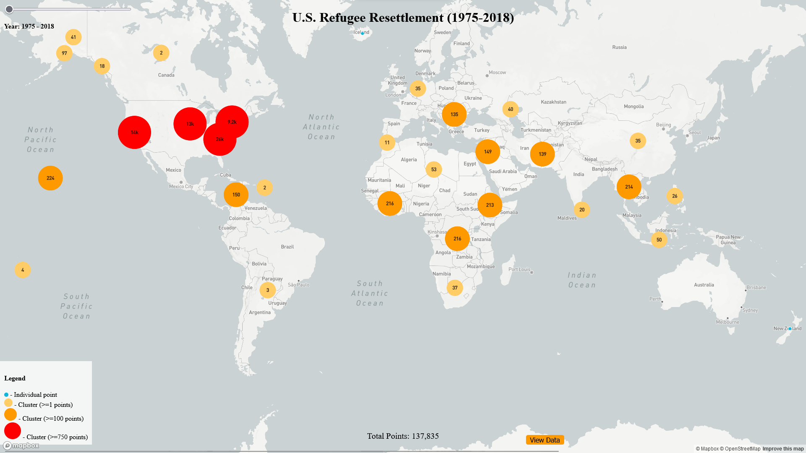

# Visualising_USA_Refugee_resettlement_data
 Discover the journey of refugees resettled in the U.S. from 1975 to 2018, a story of hope, resilience, and diversity


# Refugee Movement Visualization: A Data-Driven Interactive Map

The Refugee Movement Visualization project is an interactive, dynamic map of global refugee movements. Built with JavaScript, Mapbox GL JS, and D3.js, this project visualizes complex refugee data in a user-friendly, intuitive manner.

## Features

- **Data-Driven Interactive Map:** Utilizes Mapbox GL JS to create a global map powered by refugee movement data.
- **Dynamic Data Representation:** Includes a slider for data filtering based on the year of observation.
- **Clustering:** Includes data point clustering to identify regions with high refugee influx.
- **Detailed Pop-ups and Sidebar:** Provides specific data details on hover over data points. Clicking on cluster points reveals a sidebar with more detailed information.
- **Customizable Display:** Manage your display space with a sidebar that can be toggled on and off.

## Getting Started

These instructions will guide you on how to get the project up and running on your local machine.

### Prerequisites

- Node.js and npm ([Download and Install](https://nodejs.org/))
- A Mapbox API access token ([Get one here](https://account.mapbox.com/))

### Installation

1. **Clone the repository.**
```sh
git clone https://github.com/yourusername/RefugeeMovementVisualization.git

Navigate into the directory.
