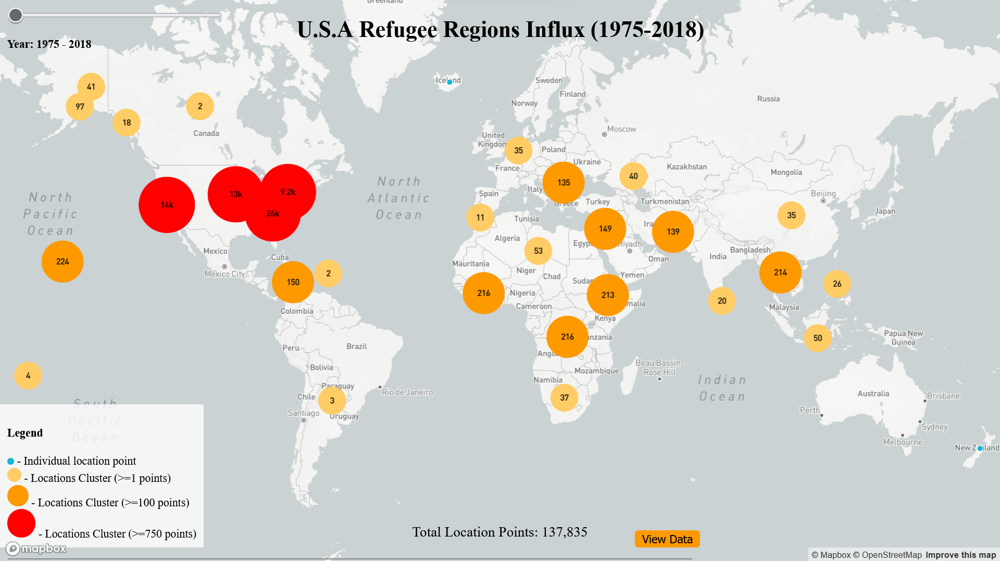

# Visualising_USA_Refugee_regions_Influx_data
 Discover the journey of refugees resettled in the U.S. from 1975 to 2018, a story of hope, resilience, and diversity


# Refugee Movement Visualization: A Data-Driven Interactive Map

The Refugee Movement Visualization project is an interactive, dynamic map of global refugee movements. Built with JavaScript, Mapbox GL JS, and D3.js, this project visualizes complex refugee data in a user-friendly, intuitive manner.

## Features

- **Data-Driven Interactive Map:** Utilizes Mapbox GL JS to create a global map powered by refugee movement data.
- **Dynamic Data Representation:** Includes a slider for data filtering based on the year of observation.
- **Clustering:** Includes data point clustering to identify regions with high refugee influx.
- **Detailed Pop-ups and Sidebar:** Provides specific data details on hover over data points. Clicking on cluster points reveals a sidebar with more detailed information.
- **Customizable Display:** Manage your display space with a sidebar that can be toggled on and off.

## Getting Started

These instructions will guide you on how to get the project up and running on your local machine.

### Prerequisites

- Node.js and npm ([Download and Install](https://nodejs.org/))
- A Mapbox API access token ([Get one here](https://account.mapbox.com/))

### Installation

1. **Clone the repository.**
```sh
git clone https://github.com/OgbondaGlory/Visualising_USA_Refugee_resettlement_data.git
```
2. **Navigate into the directory.**
```sh 
cd Visualising_USA_Refugee_resettlement_data 
```

3. **Install the required dependencies.** 
```sh 
npm install
```
4. **Update the Mapbox API token placeholder in the code.**
Locate the placeholder in the ```sh index.js ``` file and replace it with your Mapbox API access token.

5. **Update the data source.**
In ```sh index.js ```, replace ```sh 'refugee_data.csv' ``` with the path to your actual data file.

## Running the Application
```sh npm start ```
After running the above command, open your browser and navigate to the address provided in the console.

## Data Format
The data should be in CSV format, and the application converts it to GeoJSON. The data should include latitude, longitude, the number of refugees, the origin country, and the year of observation.

## Contributing
Contributions are welcome. If you're interested in enhancing the features or fixing bugs, please create a pull request, or open an issue to discuss what you would like to change.

## License
This project is licensed under the MIT License. For more information, see the LICENSE file.

